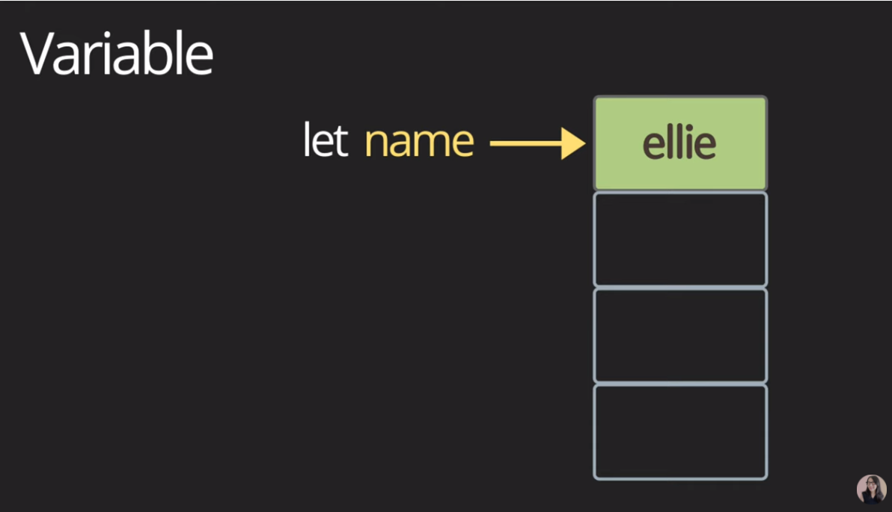
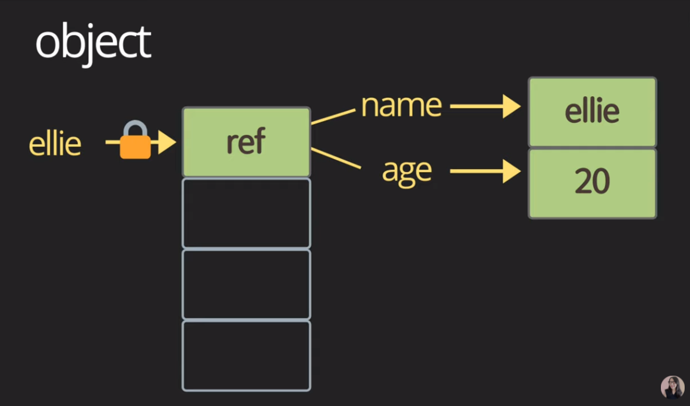
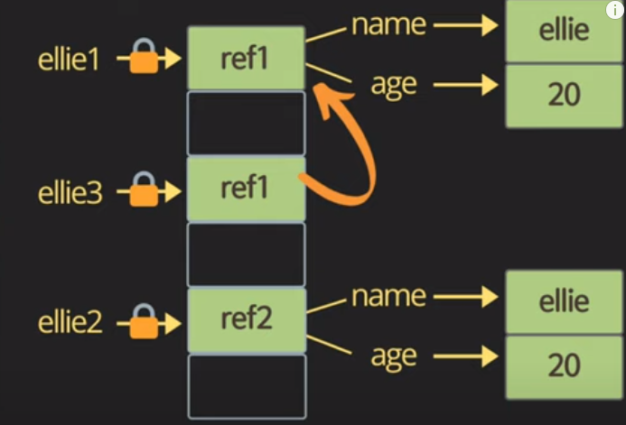
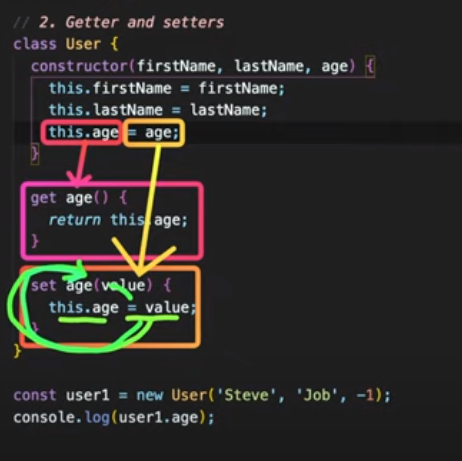

# javascript 문법

__※ javascript는 type이 없는 미친 언어이다__


### 함수

- 함수 선언

  ```javascript
  function doSomething() {
      console.log('hello');
  }
  
  function add(a, b) {
      const sum = a + b;
      return sum;
  }
  ```

  

- 함수 호출

  ```javascript
  doSomething();
  # hello
  
  const result = add(1, 2);
  console.log(result);
  # 3
  ```

  

- 응용

```javascript
function doSomething(add) {
    console.log(add);
}


doSomething(add);
# add라는 함수를 출력
doSomething(add());
# 이 때는 doSomething함수 호출보다 add의 함수호출이 먼저 이뤄진다
# NaN (Not a Number)
doSomething(add(1, 2));
# 3
```

```javascript
function doSomething(add) {
    console.log(add);
    const result = add(2, 3);
    console.log(result)
}


doSomething(add);
# add 함수
# 5
```

```javascript
const addFun = add;
console.log(addFun)
# add 함수
```


### 변수

- let (added in ES6) (read / write)

  ```javascript
  let name = 'ellie';
  console.log(name);
  # ellie
  name = 'hello'
  console.log(name);
  # hello
  ```

- Block scope

  > block 안의 값은 접근이 불가능

  ```javascript
  {
   let name = 'ellie';
  }
  
  console.log(name);
  # 
  ```

- Global scope

  > 파일안에 바로 정의해서 쓰는 함수

  ```javascript
  let globalName = 'global name';
  {
      let name = 'ellie';
      console.log(globalName);
      # global name
  }
  
  console.log(name);
  #
  console.log(globalName);
  # global name
  ```

- var (don't ever use this!)

  > 변수를 선언하기 전에도 값의 할당이 가능
  >
  > 유연성을 가지고 있지만 선언하지도 않는 변수에 값이 할당되어 나오는 경우도 존재

  ```javascript
  age = 4;
  var age;
  ```

  - var hoisting (move declaration from bottom to top)

    > 어디에서 선언했냐에 상관없이 항상 제일위로 선언을 끌어 올려주는 것

  - var has no block scope

- constant (read only)

  > 한 번 선언하면 값이 절대 바뀌지 않음

  - favor __immutable__ data type always for a few reasons:
    - security (보안상)
    - thread safety (다양한 스레드에서 동시에 접근하여 값을 바꾸는 것을 방지)
    - reduce human mistakes

  ```javascript
  const daysInWeek = 7;
  const maxNumber = 5;
  ```


### Variable types

- primitive type

  > 더이상 나눠질 수 없는 한가지의 아이템
  >
  > 값(value) 자체가 memory에 저장

  - single item: number, string, boolean, null, .undefined, symbol




- object type

  > single item을 묶어서 한 box로 관리할 수 있게 해주는 것
  >
  > reference를 통해서 실제 object를 가르키는 곳과 연결, reference가 memory에 저장

  - bpx cpmtaomer




- function type

  > function도 다른 data type처럼 변수에 할당이 가능
  >
  > 함수의 인자로 전달이 가능하고 return type으로도 function을 return 하는 것이 가능

  - first-class function


- number

  ```javascript
  const count = 17; // integer
  const size = 17.1; // decimal number
  console.log(`value: ${count}, type: ${typeof count}`);
  # value: 17, type: number
  console.log(`value: ${size}, type: ${type of size}`);
  # value: 17,1 type: number
  ```

  - number - special numeric values: infinity, -infinity, NaN

  ```javascript
  const infinity = 1 / 0;
  const negativeInfinity = -1 / 0;
  const nAn = 'not a number' / 2;
  console.log(infinity);
  # Infinity
  console.log(negativeInfinity);
  # -Infinity
  console.log(nAn);
  # NaN
  ```

  - bigInt (fairly new, don't use it yet)

  ```javascript
  const bigInt = 123987129487293847928371n; // over (-2**53 ~ 2**53)
  console.log(`value: ${bigInt}, type: ${typeof bigInt}`);
  # value: 123987129487293847928371. type: bigint
  Number.MAX_SAFE_INTEGER;
  ```

  

- string

  ```javascript
  const char = 'c';
  const brendan = 'brendan';
  const greeting 'hello ' + brendan;
  console.log(`value: ${greeting}, type: ${typeof greeting}`);
  # value: hello brendan, type: string
  const helloBob = `hi ${brendan}!`; // template literals (/string)
  console.log(`value: ${helloBob}, type: %{typeof helloBob}`);
  # value: hi brendan!, type: string
  ```


- boolean

  - false: 0, null, undefined, NaN, ''
  - true: any other value

  ```javascript
  const canRead = true;
  const test = 3 < 1; // false
  console.log(`value: ${canRead}, type: ${typeof canRead}`);
  # value: true, type: boolean
  console.log(`value: ${test}, type: ${typeof test}`);
  # value: false, type: boolean
  ```


- null

  > 텅텅 비어있는 empty값, 아무것도 아닌 것

  ```javascript
  let nothing = null;
  console.log(`value: ${nothing}, type: ${typeof nothing}`);
  ```


- undefined

  >선언은 되어있지만 아무런 값이 지정되지 않은 것

  ```javascript
  let x;
  console.log(`value: ${x}, type: ${typeof x}`);
  ```


- symbol

  >자료구조에서 고유한 식별자가 필요하거나, 동시에 다발적으로 concurrent하게 일어날 수 있는 코드에서 우선순위를 주고 싶을 때, 정말 고유한 식별자가 필요할 때 사용

  ```javascript
  const symbol1 = Symbol('id');
  const symbol2 = Symbol('id');
  console.log(symbol1 === symbol2);
  # false
  
  // 주어진 string에 맞게 symbol을 생성
  const gSymbol1 = Symbol.for('id');
  const gSymbol2 = Symbol.for('id');
  console.log(gSymbol1 === gSymbol2);
  # true
  
  // symbol을 그대로 출력하려하면 error가 발생하니 .description을 이용하여 string으로 변환하여 출력
  console.log(`value: ${symbol1}, type: ${typeof symbol1}`)
  # error
  console.log(`value: ${symbol1.description}, type: ${typeof symbol1}`)
  # value: id, type: symbol
  ```


### Dynamic typing ( dynamically typed language )

> 선언할 때 어떤 type인지 선언하지 않고, runtime(프로그램이 동작)할 때 프로그램에 의해 type이 변경

```javascript
let text = 'hello';
console.log(text.charAt(0));
# h
console.log(`value: ${text}, type: ${typeof text}`);
# value: hello, type: string
text = 1;
console.log(`value: ${text}, type: ${typeof text}`);
# value: 1, type: number
text = '7' + 5;
console.log(`value: ${text}, type: ${typeof text}`);
# value: 75, type: string
text = '8' / '2';
console.log(`value: ${text}, type: ${typeof text}`);
# value: 4, type: number
console.log(text.charAt(0));
# error
```


### object, real-life object, data structure

```javascript
const ellie = { name: 'ellie', age: 20 };
ellie.age = 21;
```

> ellie라는 포인터에 의해 정해진 object는 변경할 수 없지만 object안의 name과 age는 변경할 수 있다.


### Operator

1. String concatenation

   ```javascript
   console.log('my' + ' cat');
   # my cat
   console.log('1' + 2);
   # 12
   console.log(`string literals: 1 + 2 = ${1 + 2}`);
   # string literals: 3
   ```

2. Numeric operators

   ```javascript
   console.log(1 + 1); // add
   console.log(1 - 1); // substract
   console.log(1 / 1); // divide
   console.log(1 * 1); // multiply
   console.log(5 % 2); // remainder
   console.log(2 ** 3); // exponentiation
   ```

3. Increment and decrement operators

   ```javascript
   let counter = 2;
   const preIncrement = ++counter;
   // counter = counter + 1;
   // preIncrement = counter;
   
   const postIncrement = counter++;
   // postIncrement = counter;
   // counter = counter + 1;
   ```

4. Assignment operators

   ```javascript
   let x = 3;
   let y = 6;
   x += y; // x = x + y
   x -= y;
   x *= y;
   x /= y;
   ```

5. Comparison operators

   ```javascript
   console.log(10 < 6); // less than
   console.log(10 <= 6); // less than or equal
   console.log(10 > 6); // greater than
   console.log(10 >= 6); // greater than or equal
   ```

6. Logical operators: || (or), && (and), ! (not)

   ```javascript
   function check() {
       for (let i = 0; i < 10; i++) {
           //wasting time
           console.log('😱')
       }
       return true;
   }
   ```

   - || (or)

     > finds the first truthy value
     >
     > 하나만 true인 것을 찾으면 어차피 true이기 때문에 그 즉시 logic을 멈춘다
     >
     > heavy한 operation일 수록 뒤에 두는게 좋음

     ```javascript
     const value1 = true;
     const value2 = 4 < 2; // false
     
     console.log(`or: ${value1 || value2 || check()}`);
     // value1이나 value2가 true의 값이라면 check함수는 실행되지 않는다
     # or: true
     ```

   - && (and)

     > finds the first falsy value
     >
     > 하나만 false인 것을 찾으면 어차피 false이기 때문에 그 즉시 logic을 멈춘다
     >
     > heavy한 operation일 수록 뒤에 두는게 좋음

     ```javascript
     const value1 = false;
     const value2 = 4 < 2; // false
     
     console.log(`and: ${value1 && value2 && check()}`);
     // value1이나 value2가 false의 값이라면 check함수는 실행되지 않는다
     # and: false
     ```

     - null value를 찾을 때 유용하게 사용

       ```javascript
       // nullableObject가 null이 아닐때만 something을 받아오도록 만들기
       // nullableObject && nullableObject.something
       if (nullableObject != null) {
           nullableObject.something;
       }
       ```

   - ! (not)

     ```javascript
     const value1 = true;
     console.log(!value1);
     # false
     ```

7. Equality

   ```javascript
   const stringFive = '5';
   const numberFive = 5;
   ```

   - == loose equality, with type conversion

     ```javascript
     console.log(stringFive == numberFive);
     # true
     console.log(stringFive != numberFive);
     # false
     ```

   - === strict equality, no type conversion

     ```javascript
     console.log(stringFive === numberFive);
     # false
     console.log(stringFive !== numberFive);
     # true
     ```

   - object equality by reference

     ```javascript
     const ellie1 = { name: 'ellie' };
     const ellie2 = { name: 'ellie' };
     const ellie3 = ellie1;
     console.log(ellie1 == ellie2);
     # false
     console.log(ellie1 === ellie2);
     # false
     console.log(ellie1 === ellie3);
     # true
     ```

     

   - puzzler

     ```javascript
     console.log(0 == false); // true
     console.log(0 === false); // false
     console.log('' == false); // true
     console.log('' === false); // false 
     console.log(null == undefined); // true
     console.log(null === undefined); // false
     ```

8. Conditional operators: if

   > if, else if, else

   ```javascript
   const name = 'ellie';
   if (name === 'ellie') {
       console.log('Welcome, Ellie!');
   } else if (name === 'coder') {
       console.log('You are amazing coder');
   } else {
       console.log('unknown');
   }
   ```

9. Ternary operator: ?

   > condition ? value1 : value2;
   >
   > 앞의 수식이 true라면 value1을 실행하고 아니라면 value2를 실행

   ```javascript
   console.log(name === 'ellie' ? 'yes' : 'no');
   ```

10. Switch statement

    > use for multiple if checks
    >
    > use for enum-like value check
    >
    > use for multiple type checks in TS

    ```javascript
    const browser = 'IE';
    switch (browser) {
        case 'IE':
            console.log('go away!');
            break;
        case 'Chrome':
            console.log('love you!');
            break;
        case 'Firefox':
            console.log('love you!');
            break;
        // case 'Chrome'과 'Firefox'의 경우 코드가 같기 때문에
       	// case 'Chrome':
        // case 'Firefox':
        //     console.log('love you!');
        //     break;
        // 처럼 연달아 적으면 'Chrome'이나 'Firefox'일 때 실행된다
        default:
            console.log('same all!');
            break;
    }
    ```

11. Loops

    - while loop

      > while the condition is truthy, body code is executed

      ```javascript
      let i = 3;
      while (i > 0) {
          console.log(`while: ${i}`);
          i--;
      }
      # while: 3
      # while: 2
      # while: 1
      ```

    - do while loop

      > body code is executed first, then check the condition
      >
      > {}블럭을 실행한 뒤에 조건이 맞는지 검사한다

      ```javascript
      do {
          console.log(`do while: ${i}`);
          i--;
      } while (i > 0);
      # do while: 0
      ```

    - for loop

      > for(begin; condition; step)

      ```javascript
      for (i = 3; i > 0; i--) {
          console.log(`for: ${i}`);
      }
      # for: 3
      # for: 2
      # for: 1
      
      // inline variable declaration
      // i라는 지역변수를 설정해서 시작
      for (let i = 3; i > 0; i = i - 2) {
          console.log(`inline variable for: ${i}`);
      }
      # inline variable for: 3
      # inline variable for: 1
      ```

    - nested loops

      ```javascript
      for (let i = 0; i < 10; i++) {
          for (let j = 0; j < 10; j++) {
              console.log(`i: ${i}, j:${j}`);
          }
      }
      ```

      


### Function

1. Function delaration

   > one function === one thing
   >
   > naming: doSomething, command, verb
   >
   > e.g. createCardAndpoint -> createCard, createPoint 
   >
   > 한가지의 함수는 하나의 일을 하도록 만드는 것이 좋고, 더 세분화해서 나눌 수 있는지 고민해야 한다
   >
   > function is object in JS

   ```javascript
   function log(message) {
       console.log(message);
   }
   log('Hello@');
   # Hello@
   log(1234);
   # 1234
   ```

2. Parameters

   > premitive parameters: passed by value
   >
   > object parameters: passed by reference

   ```javascript
   function changeName(obj) {
       obj.name = 'coder';
   }
   const ellie = { name: 'ellie' };
   changeName(ellie);
   console.log(ellie);
   # {name: 'coder'}
   ```

3. Default parameters (added in ES6)

   > 사용자가 parameter의 값을 정하지 않았을 때 default값으로 넘겨준다

   ```javascript
   function showMessage(message, from = 'unknown') {
       console.log(`${message} by ${from}`);
   }
   showMessage('Hi!');
   # Hi! by unknown
   ```

4. Rest parameters (added in ES6)

   > `...args` 를 이용하여 배열의 형태로 parameter를 전달

   ```javascript
   function printAll(...args) {
       for (let i = 0; i < args.length; i++) {
           console.log(args[i]);
       }
   }
   	// 간단한 방법
   	for (const arg of args) {
           console.log(arg);
       }
   	// 더 간단한 방법
   	args.forEach((arg) => console.log(arg));
   
   print('dream', 'coding', 'ellie');
   # dream
   # coding
   # ellie
   ```

5. Local scope

   > 밖에서는 안이 보이지 않고, 안에서만 밖을 볼 수 있다
   >
   > 부모안의 variable은 자식이 확인할 수 있지만 자식안의 variable은 부모가 확인할 수 없다

   ```javascript
   let globalMessage = 'global'; // global variable
   function printNessage() {
       let message = 'hello'; // local variable
       console.log(message); 
       # hello
       console.log(globalMessage);
       # global
   }
   console.log(message)
   # error
   ```

6. Return a value

   > return 을 따로 명시해주지 않으면 기본으로 return은 undefined

   ```javascript
   function sum(a, b) {
       return a + b;
   }
   const result = sun(1, 2); // 3
   console.log(`sum: ${sum(1, 2)}`);
   # sum: 3
   ```

7.  Early return, early exit

   ```javascript
   // bad
   function upgradeUser(user) {
       if (user.point > 10) {
           // long upgrade logic...
       }
   }
   
   // good
   function upgradeUser(user) {
       if (user.point <= 10) {
           return;
       }
       // long upgrade logic...
   }
   ```


#### First-class function

	- functions are treated like any other variable
	- can be assigned as a value to variable
	- can be passed as an argument to other functions
	- can be returned by another function

1. Function expression

   > a function declaration can be called earlier than it is defined. (hoisted)
   >
   > a function expression is created when the execution reaches it

   ```javascript
   const print = function () { // anonymous function (이름이 없는 함수)
       console.log('print');
   };
   print();
   const printAgain = print; // print라는 이름없는 함수에게 printAgain이라는 `함수이름`을 정의
   printAgain();
   const sumAgain = sum;
   console.log(sumAgain(1, 3));  
   ```

2. Callback function using function expression

   ```javascript
   function randomQuiz(answer, printYes, printNo) {
       if (answer === 'love you') {
           printYes();
       } else {
           printNo();
       }
   }
   
   // anonymous function
   const printYes = function () {
       console.log('yes!');
   };
   // named function
   // better debugging in debugger's stack traces
   // recursions
   const printNo = function print() {
       console.log('no!');
   };
   randomQuiz('wrong', printYes, printNo);
   # no!
   randomQuiz('love you', printYes, printNo);
   # yes!
   ```

3. Arrow function

   > always anonymous

   ```javascript
   const simplePrint = function () {
       console.log('simplePrint!');
   };
   const add = function (a, b) {
       return a + b;
   }
   
   // Arrow function
   const simplePrint = () => console.log('simplePrint!');
   const add = (a, b) => a + b;
   
   // block안에서 사용할 경우 return이라는 키워드를 통해 값을 반환해줘야 한다
   const simpleMultiply = (a, b) => {
       // do something more
       return a * b
   }
   ```

4. IIFE

   > Immediately Invoked Function Expression
   >
   > 함수 선언과 동시에 실행

   ```javascript
   (function hello() {
       console.log('IIFE');
   })();
   # IIFE
   ```


### class (add in ES6)

- template
- declare once
- no data in

1. Class declarations

   ```javascript
   class Person {
       // constructor
       constructor(name, age) {
           // fields
           this.name = name;
           this.age = age;
       }
      	// methods
       speak() {
           console.log(`${this.name}: hello!`);
       }
   }
   
   const ellie = new Person('ellie', 20);
   console.log(ellie.name);
   # ellie
   console.log(ellie.age);
   # 20
   ellie.speak();
   # ellie: hello!
   ```

2. Getter and setters

   ```javascript
   class User {
       constructor(firstName, lstName, age) {
           this.firstName = firstName;
           this.lastName = lastName;
           this.age = age;
       }
       
       get age() {
           return this.agePrivate;
       }
       
       set age(value) {
           // if (value < 0) {
           //     throw Error('age can not be negative');
           // }
           this.agePrivate = value < 0 ? 0 : value;
       }
   }
   
   const user1 = new User('Steve', 'Job', -1);
   console.log(user1.age);
   # -1
   
   ```

   

3. Fields (public, private)

   > Too soon!
   >
   > class 내부에서만 값이 보여지고 변경이 가능
   >
   > class 외부에서는 값을 변경, 접근할 수 없다

   ```javascript
   class Experiment {
       publicField = 2;
   	#privateField = 0;
   }
   const experiment = new Experiment();
   console.log(experiment.publicField);
   console.log(experiment.privateField);
   ```

4. Static properties and methods

   > Too soon!
   >
   > class 자체에 값을 할당하고 instance생성시 복제하는 개념
   >
   > object에 상관없이, 들어오는 data에 상관없이 공통적으로 class에서 쓸 수 있는 것이라면 static과 static method를 사용하여 작성하는 것이 memory의 사용을 줄여준다

   ```javascript
   class Article {
       static publisher = 'Dream Coding';
       constructor(articleNumber) {
           this.articleNumber = articleNumber;
       }
   
       static printPublisher() {
           console.log(Article.publisher);
       }
   }
   
   const article1 = new Article(1);
   const article2 = new Article(2);
   console.log(article1.publisher);
   # undefined
   console.log(Article.publisher);
   # Dream Coding
   Article.printPublisher();
   # Dream Coding
   ```

5. 


### object

- instance of a class
- created many times
- data in